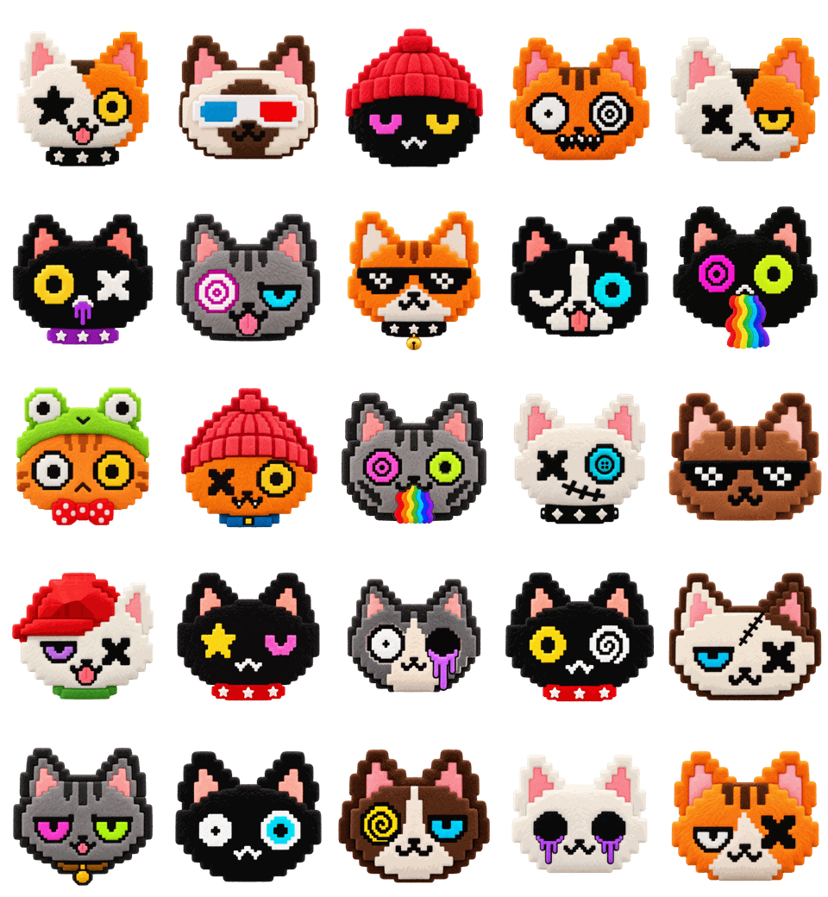

# Weird Cats Plush Pets

*Community pet skins for Codex pets and ChatGPT Dots.*



Twenty-five felt Weird Cats heads, the 25 Weird Cats Codex Pets characters, made as animated pets for **Codex** and the **ChatGPT desktop app**. Each one floats, blinks, follows your cursor with its eyes, thinks in three dots while the agent works, asks with a **?** when it needs you, and lights a bulb when the result is ready. Use one as your Codex pet, or pick it as the look of your Dot.

| Cat | Signature move |
| --- | --- |
| Lucky | star eye and a ring eye that follows you |
| Stereo | 3D glasses that lift instead of blinking |
| Beanie | knit beanie on a spring |
| Weirdo | wandering `+` pupil and a spiral centre |
| Ember | an X and a sleepy yellow eye |
| Violet | swinging purple drool |
| Hypno | hypno spiral that tracks you |
| Smoke | pixel shades and a swinging gold bell |
| Tux | tuxedo wink and a cyan ring eye |
| Prism | a rainbow that swings as it moves |
| Frog Hat | frog hat on a spring and two roaming pupils |
| Rusty | knit beanie on a spring, an X and a ring eye |
| Spectrum | hypno eye, a roaming pupil and a swinging rainbow |
| Glitch | stitched mouth and a cyan button eye |
| Mocha | pixel shades that lift instead of blinking |
| Flip | cap on a spring, a sleepy eye and an X |
| Nova | star eye and a pink wink |
| Drip | a roaming `+` pupil and a hollow eye that oozes |
| Ash | a ring eye that tracks you and a spiral |
| Patch | stitched scar, a sleepy blue eye and an X |
| Mellow | two sleepy neon eyes and a swinging gold bell |
| Orbit | two roaming pupils, one plain, one cyan |
| Slime | spiral eye and a sleepy blue eye |
| Phantom | void eyes that ooze and never blink |
| Wink | a sleepy eye and an X |

## Install

The pets are standard Codex pet packages (`pet.json` + an 8×11 `spritesheet.webp`, `spriteVersionNumber: 2`). Pick the way that suits you. They all end the same way: restart Codex or ChatGPT, open **Settings → Pets**, and choose a cat whose name ends in *Weird Cats Plush Pets*.

### 1. Ask Codex (recommended, no terminal)

Paste this into a Codex chat and let the agent do it (it follows the instructions in [AGENTS.md](AGENTS.md)):

```text
Install the Weird Cats Plush Pets into my Codex pets by following https://raw.githubusercontent.com/nett0eth/weird-cats-plush-pets/main/AGENTS.md
```

Only want a few? Add them to the prompt, for example "only Lucky and Prism".

### 2. One click per cat

Each cat has a `codex://pets/install` link that opens an "Install <cat>?" dialog in the Codex / ChatGPT desktop app. The links are in [install/deeplinks.json](install/deeplinks.json) and in the table below, and the [Plushifier page](https://weirdcats.xyz/plush/) offers the link for the cat you have selected. They fetch the spritesheet from raw.githubusercontent.com, so they only work while the repository is public. (GitHub may not make `codex://` links clickable in this table; open them from the [Plushifier page](https://weirdcats.xyz/plush/) or paste one into your browser's address bar.)

| Cat | Link |
| --- | --- |
| Ash | [Install Ash](codex://pets/install?name=Ash%20-%20Weird%20Cats%20Plush%20Pets&description=Felt%20Weird%20Cat%20head%20from%20the%20Weird%20Cats%20Plush%20Pets%20community%20pack%3A%20floats%2C%20blinks%2C%20thinks%20in%20three%20dots%20and%20lights%20a%20bulb%20when%20the%20work%20is%20ready.&imageUrl=https%3A%2F%2Fraw.githubusercontent.com%2Fnett0eth%2Fweird-cats-plush-pets%2Fmain%2Fpets%2Fweird-cats-plush-ash%2Fspritesheet.webp&spriteVersionNumber=2) |
| Beanie | [Install Beanie](codex://pets/install?name=Beanie%20-%20Weird%20Cats%20Plush%20Pets&description=Felt%20Weird%20Cat%20head%20from%20the%20Weird%20Cats%20Plush%20Pets%20community%20pack%3A%20floats%2C%20blinks%2C%20thinks%20in%20three%20dots%20and%20lights%20a%20bulb%20when%20the%20work%20is%20ready.&imageUrl=https%3A%2F%2Fraw.githubusercontent.com%2Fnett0eth%2Fweird-cats-plush-pets%2Fmain%2Fpets%2Fweird-cats-plush-beanie%2Fspritesheet.webp&spriteVersionNumber=2) |
| Drip | [Install Drip](codex://pets/install?name=Drip%20-%20Weird%20Cats%20Plush%20Pets&description=Felt%20Weird%20Cat%20head%20from%20the%20Weird%20Cats%20Plush%20Pets%20community%20pack%3A%20floats%2C%20blinks%2C%20thinks%20in%20three%20dots%20and%20lights%20a%20bulb%20when%20the%20work%20is%20ready.&imageUrl=https%3A%2F%2Fraw.githubusercontent.com%2Fnett0eth%2Fweird-cats-plush-pets%2Fmain%2Fpets%2Fweird-cats-plush-drip%2Fspritesheet.webp&spriteVersionNumber=2) |
| Ember | [Install Ember](codex://pets/install?name=Ember%20-%20Weird%20Cats%20Plush%20Pets&description=Felt%20Weird%20Cat%20head%20from%20the%20Weird%20Cats%20Plush%20Pets%20community%20pack%3A%20floats%2C%20blinks%2C%20thinks%20in%20three%20dots%20and%20lights%20a%20bulb%20when%20the%20work%20is%20ready.&imageUrl=https%3A%2F%2Fraw.githubusercontent.com%2Fnett0eth%2Fweird-cats-plush-pets%2Fmain%2Fpets%2Fweird-cats-plush-ember%2Fspritesheet.webp&spriteVersionNumber=2) |
| Flip | [Install Flip](codex://pets/install?name=Flip%20-%20Weird%20Cats%20Plush%20Pets&description=Felt%20Weird%20Cat%20head%20from%20the%20Weird%20Cats%20Plush%20Pets%20community%20pack%3A%20floats%2C%20blinks%2C%20thinks%20in%20three%20dots%20and%20lights%20a%20bulb%20when%20the%20work%20is%20ready.&imageUrl=https%3A%2F%2Fraw.githubusercontent.com%2Fnett0eth%2Fweird-cats-plush-pets%2Fmain%2Fpets%2Fweird-cats-plush-flip%2Fspritesheet.webp&spriteVersionNumber=2) |
| Frog Hat | [Install Frog Hat](codex://pets/install?name=Frog%20Hat%20-%20Weird%20Cats%20Plush%20Pets&description=Felt%20Weird%20Cat%20head%20from%20the%20Weird%20Cats%20Plush%20Pets%20community%20pack%3A%20floats%2C%20blinks%2C%20thinks%20in%20three%20dots%20and%20lights%20a%20bulb%20when%20the%20work%20is%20ready.&imageUrl=https%3A%2F%2Fraw.githubusercontent.com%2Fnett0eth%2Fweird-cats-plush-pets%2Fmain%2Fpets%2Fweird-cats-plush-frog-hat%2Fspritesheet.webp&spriteVersionNumber=2) |
| Glitch | [Install Glitch](codex://pets/install?name=Glitch%20-%20Weird%20Cats%20Plush%20Pets&description=Felt%20Weird%20Cat%20head%20from%20the%20Weird%20Cats%20Plush%20Pets%20community%20pack%3A%20floats%2C%20blinks%2C%20thinks%20in%20three%20dots%20and%20lights%20a%20bulb%20when%20the%20work%20is%20ready.&imageUrl=https%3A%2F%2Fraw.githubusercontent.com%2Fnett0eth%2Fweird-cats-plush-pets%2Fmain%2Fpets%2Fweird-cats-plush-glitch%2Fspritesheet.webp&spriteVersionNumber=2) |
| Hypno | [Install Hypno](codex://pets/install?name=Hypno%20-%20Weird%20Cats%20Plush%20Pets&description=Felt%20Weird%20Cat%20head%20from%20the%20Weird%20Cats%20Plush%20Pets%20community%20pack%3A%20floats%2C%20blinks%2C%20thinks%20in%20three%20dots%20and%20lights%20a%20bulb%20when%20the%20work%20is%20ready.&imageUrl=https%3A%2F%2Fraw.githubusercontent.com%2Fnett0eth%2Fweird-cats-plush-pets%2Fmain%2Fpets%2Fweird-cats-plush-hypno%2Fspritesheet.webp&spriteVersionNumber=2) |
| Lucky | [Install Lucky](codex://pets/install?name=Lucky%20-%20Weird%20Cats%20Plush%20Pets&description=Felt%20Weird%20Cat%20head%20from%20the%20Weird%20Cats%20Plush%20Pets%20community%20pack%3A%20floats%2C%20blinks%2C%20thinks%20in%20three%20dots%20and%20lights%20a%20bulb%20when%20the%20work%20is%20ready.&imageUrl=https%3A%2F%2Fraw.githubusercontent.com%2Fnett0eth%2Fweird-cats-plush-pets%2Fmain%2Fpets%2Fweird-cats-plush-lucky%2Fspritesheet.webp&spriteVersionNumber=2) |
| Mellow | [Install Mellow](codex://pets/install?name=Mellow%20-%20Weird%20Cats%20Plush%20Pets&description=Felt%20Weird%20Cat%20head%20from%20the%20Weird%20Cats%20Plush%20Pets%20community%20pack%3A%20floats%2C%20blinks%2C%20thinks%20in%20three%20dots%20and%20lights%20a%20bulb%20when%20the%20work%20is%20ready.&imageUrl=https%3A%2F%2Fraw.githubusercontent.com%2Fnett0eth%2Fweird-cats-plush-pets%2Fmain%2Fpets%2Fweird-cats-plush-mellow%2Fspritesheet.webp&spriteVersionNumber=2) |
| Mocha | [Install Mocha](codex://pets/install?name=Mocha%20-%20Weird%20Cats%20Plush%20Pets&description=Felt%20Weird%20Cat%20head%20from%20the%20Weird%20Cats%20Plush%20Pets%20community%20pack%3A%20floats%2C%20blinks%2C%20thinks%20in%20three%20dots%20and%20lights%20a%20bulb%20when%20the%20work%20is%20ready.&imageUrl=https%3A%2F%2Fraw.githubusercontent.com%2Fnett0eth%2Fweird-cats-plush-pets%2Fmain%2Fpets%2Fweird-cats-plush-mocha%2Fspritesheet.webp&spriteVersionNumber=2) |
| Nova | [Install Nova](codex://pets/install?name=Nova%20-%20Weird%20Cats%20Plush%20Pets&description=Felt%20Weird%20Cat%20head%20from%20the%20Weird%20Cats%20Plush%20Pets%20community%20pack%3A%20floats%2C%20blinks%2C%20thinks%20in%20three%20dots%20and%20lights%20a%20bulb%20when%20the%20work%20is%20ready.&imageUrl=https%3A%2F%2Fraw.githubusercontent.com%2Fnett0eth%2Fweird-cats-plush-pets%2Fmain%2Fpets%2Fweird-cats-plush-nova%2Fspritesheet.webp&spriteVersionNumber=2) |
| Orbit | [Install Orbit](codex://pets/install?name=Orbit%20-%20Weird%20Cats%20Plush%20Pets&description=Felt%20Weird%20Cat%20head%20from%20the%20Weird%20Cats%20Plush%20Pets%20community%20pack%3A%20floats%2C%20blinks%2C%20thinks%20in%20three%20dots%20and%20lights%20a%20bulb%20when%20the%20work%20is%20ready.&imageUrl=https%3A%2F%2Fraw.githubusercontent.com%2Fnett0eth%2Fweird-cats-plush-pets%2Fmain%2Fpets%2Fweird-cats-plush-orbit%2Fspritesheet.webp&spriteVersionNumber=2) |
| Patch | [Install Patch](codex://pets/install?name=Patch%20-%20Weird%20Cats%20Plush%20Pets&description=Felt%20Weird%20Cat%20head%20from%20the%20Weird%20Cats%20Plush%20Pets%20community%20pack%3A%20floats%2C%20blinks%2C%20thinks%20in%20three%20dots%20and%20lights%20a%20bulb%20when%20the%20work%20is%20ready.&imageUrl=https%3A%2F%2Fraw.githubusercontent.com%2Fnett0eth%2Fweird-cats-plush-pets%2Fmain%2Fpets%2Fweird-cats-plush-patch%2Fspritesheet.webp&spriteVersionNumber=2) |
| Phantom | [Install Phantom](codex://pets/install?name=Phantom%20-%20Weird%20Cats%20Plush%20Pets&description=Felt%20Weird%20Cat%20head%20from%20the%20Weird%20Cats%20Plush%20Pets%20community%20pack%3A%20floats%2C%20blinks%2C%20thinks%20in%20three%20dots%20and%20lights%20a%20bulb%20when%20the%20work%20is%20ready.&imageUrl=https%3A%2F%2Fraw.githubusercontent.com%2Fnett0eth%2Fweird-cats-plush-pets%2Fmain%2Fpets%2Fweird-cats-plush-phantom%2Fspritesheet.webp&spriteVersionNumber=2) |
| Prism | [Install Prism](codex://pets/install?name=Prism%20-%20Weird%20Cats%20Plush%20Pets&description=Felt%20Weird%20Cat%20head%20from%20the%20Weird%20Cats%20Plush%20Pets%20community%20pack%3A%20floats%2C%20blinks%2C%20thinks%20in%20three%20dots%20and%20lights%20a%20bulb%20when%20the%20work%20is%20ready.&imageUrl=https%3A%2F%2Fraw.githubusercontent.com%2Fnett0eth%2Fweird-cats-plush-pets%2Fmain%2Fpets%2Fweird-cats-plush-prism%2Fspritesheet.webp&spriteVersionNumber=2) |
| Rusty | [Install Rusty](codex://pets/install?name=Rusty%20-%20Weird%20Cats%20Plush%20Pets&description=Felt%20Weird%20Cat%20head%20from%20the%20Weird%20Cats%20Plush%20Pets%20community%20pack%3A%20floats%2C%20blinks%2C%20thinks%20in%20three%20dots%20and%20lights%20a%20bulb%20when%20the%20work%20is%20ready.&imageUrl=https%3A%2F%2Fraw.githubusercontent.com%2Fnett0eth%2Fweird-cats-plush-pets%2Fmain%2Fpets%2Fweird-cats-plush-rusty%2Fspritesheet.webp&spriteVersionNumber=2) |
| Slime | [Install Slime](codex://pets/install?name=Slime%20-%20Weird%20Cats%20Plush%20Pets&description=Felt%20Weird%20Cat%20head%20from%20the%20Weird%20Cats%20Plush%20Pets%20community%20pack%3A%20floats%2C%20blinks%2C%20thinks%20in%20three%20dots%20and%20lights%20a%20bulb%20when%20the%20work%20is%20ready.&imageUrl=https%3A%2F%2Fraw.githubusercontent.com%2Fnett0eth%2Fweird-cats-plush-pets%2Fmain%2Fpets%2Fweird-cats-plush-slime%2Fspritesheet.webp&spriteVersionNumber=2) |
| Smoke | [Install Smoke](codex://pets/install?name=Smoke%20-%20Weird%20Cats%20Plush%20Pets&description=Felt%20Weird%20Cat%20head%20from%20the%20Weird%20Cats%20Plush%20Pets%20community%20pack%3A%20floats%2C%20blinks%2C%20thinks%20in%20three%20dots%20and%20lights%20a%20bulb%20when%20the%20work%20is%20ready.&imageUrl=https%3A%2F%2Fraw.githubusercontent.com%2Fnett0eth%2Fweird-cats-plush-pets%2Fmain%2Fpets%2Fweird-cats-plush-smoke%2Fspritesheet.webp&spriteVersionNumber=2) |
| Spectrum | [Install Spectrum](codex://pets/install?name=Spectrum%20-%20Weird%20Cats%20Plush%20Pets&description=Felt%20Weird%20Cat%20head%20from%20the%20Weird%20Cats%20Plush%20Pets%20community%20pack%3A%20floats%2C%20blinks%2C%20thinks%20in%20three%20dots%20and%20lights%20a%20bulb%20when%20the%20work%20is%20ready.&imageUrl=https%3A%2F%2Fraw.githubusercontent.com%2Fnett0eth%2Fweird-cats-plush-pets%2Fmain%2Fpets%2Fweird-cats-plush-spectrum%2Fspritesheet.webp&spriteVersionNumber=2) |
| Stereo | [Install Stereo](codex://pets/install?name=Stereo%20-%20Weird%20Cats%20Plush%20Pets&description=Felt%20Weird%20Cat%20head%20from%20the%20Weird%20Cats%20Plush%20Pets%20community%20pack%3A%20floats%2C%20blinks%2C%20thinks%20in%20three%20dots%20and%20lights%20a%20bulb%20when%20the%20work%20is%20ready.&imageUrl=https%3A%2F%2Fraw.githubusercontent.com%2Fnett0eth%2Fweird-cats-plush-pets%2Fmain%2Fpets%2Fweird-cats-plush-stereo%2Fspritesheet.webp&spriteVersionNumber=2) |
| Tux | [Install Tux](codex://pets/install?name=Tux%20-%20Weird%20Cats%20Plush%20Pets&description=Felt%20Weird%20Cat%20head%20from%20the%20Weird%20Cats%20Plush%20Pets%20community%20pack%3A%20floats%2C%20blinks%2C%20thinks%20in%20three%20dots%20and%20lights%20a%20bulb%20when%20the%20work%20is%20ready.&imageUrl=https%3A%2F%2Fraw.githubusercontent.com%2Fnett0eth%2Fweird-cats-plush-pets%2Fmain%2Fpets%2Fweird-cats-plush-tux%2Fspritesheet.webp&spriteVersionNumber=2) |
| Violet | [Install Violet](codex://pets/install?name=Violet%20-%20Weird%20Cats%20Plush%20Pets&description=Felt%20Weird%20Cat%20head%20from%20the%20Weird%20Cats%20Plush%20Pets%20community%20pack%3A%20floats%2C%20blinks%2C%20thinks%20in%20three%20dots%20and%20lights%20a%20bulb%20when%20the%20work%20is%20ready.&imageUrl=https%3A%2F%2Fraw.githubusercontent.com%2Fnett0eth%2Fweird-cats-plush-pets%2Fmain%2Fpets%2Fweird-cats-plush-violet%2Fspritesheet.webp&spriteVersionNumber=2) |
| Weirdo | [Install Weirdo](codex://pets/install?name=Weirdo%20-%20Weird%20Cats%20Plush%20Pets&description=Felt%20Weird%20Cat%20head%20from%20the%20Weird%20Cats%20Plush%20Pets%20community%20pack%3A%20floats%2C%20blinks%2C%20thinks%20in%20three%20dots%20and%20lights%20a%20bulb%20when%20the%20work%20is%20ready.&imageUrl=https%3A%2F%2Fraw.githubusercontent.com%2Fnett0eth%2Fweird-cats-plush-pets%2Fmain%2Fpets%2Fweird-cats-plush-weirdo%2Fspritesheet.webp&spriteVersionNumber=2) |
| Wink | [Install Wink](codex://pets/install?name=Wink%20-%20Weird%20Cats%20Plush%20Pets&description=Felt%20Weird%20Cat%20head%20from%20the%20Weird%20Cats%20Plush%20Pets%20community%20pack%3A%20floats%2C%20blinks%2C%20thinks%20in%20three%20dots%20and%20lights%20a%20bulb%20when%20the%20work%20is%20ready.&imageUrl=https%3A%2F%2Fraw.githubusercontent.com%2Fnett0eth%2Fweird-cats-plush-pets%2Fmain%2Fpets%2Fweird-cats-plush-wink%2Fspritesheet.webp&spriteVersionNumber=2) |

### 3. From a terminal (optional)

For people who prefer to run it themselves. This is the same script the Codex agent runs.

**Windows (PowerShell)**

```powershell
irm https://raw.githubusercontent.com/nett0eth/weird-cats-plush-pets/main/install/install.ps1 | iex
```

**macOS / Linux**

```sh
curl -fsSL https://raw.githubusercontent.com/nett0eth/weird-cats-plush-pets/main/install/install.sh | sh
```

It downloads the pack to a temp folder, installs all 25 cats into `~/.codex/pets` (or `$CODEX_HOME/pets`), then cleans up after itself.

Only some cats? Name them:

```powershell
$env:PLUSH = "lucky,prism"; irm https://raw.githubusercontent.com/nett0eth/weird-cats-plush-pets/main/install/install.ps1 | iex
```

```sh
curl -fsSL https://raw.githubusercontent.com/nett0eth/weird-cats-plush-pets/main/install/install.sh | sh -s -- lucky prism
```

### 4. From a clone

```powershell
git clone https://github.com/nett0eth/weird-cats-plush-pets.git
cd weird-cats-plush-pets
.\install\install.ps1             # all 25
.\install\install.ps1 lucky prism # or just some
# if Windows says running scripts is disabled:
powershell -ExecutionPolicy Bypass -File .\install\install.ps1
```

```sh
git clone https://github.com/nett0eth/weird-cats-plush-pets.git
cd weird-cats-plush-pets
./install/install.sh               # or: ./install/install.sh lucky prism
```

### Remove

Windows: `.\install\install.ps1 -Uninstall` (add cat ids to remove only those). macOS / Linux: `./install/install.sh --uninstall`. Through the one-liner, set `PLUSH_UNINSTALL=1` (`$env:PLUSH_UNINSTALL = 1` in PowerShell).

Environment variables the installers read: `CODEX_HOME` (default `~/.codex`), `PLUSH` (comma separated cat ids), `PLUSH_UNINSTALL`, `PLUSH_ARCHIVE_URL` (download override).

## How the animation maps to the app

| App state | What the cat does |
| --- | --- |
| idle | slow float and breathing |
| running left / right | little hops, leaning and looking where it goes |
| waving | head wave |
| jumping | crouch, lift, land |
| failed | deflates, half-closed eyes looking down |
| waiting for you | tilts its head under a **?** |
| working | three dots bounce above its head |
| review ready | a warm bulb lights up |
| looking around | 16 eye directions that follow the cursor |

When a pet is used as the look of a Dot, the app only plays the idle and working states.

---

## Licence

- **Scripts** (`install/`, `AGENTS.md`): [MIT](LICENSE).
- **Art** (everything in `pets/` and `assets/`): © nett0eth, Weird Cats. All rights reserved. You may install the pets and use them as your own Codex / ChatGPT pets and Dot looks, and share screenshots and videos of them. Please don't resell them, redistribute the art as your own, or use it commercially. See [ART-LICENSE.md](ART-LICENSE.md).

Fan-made community project. Not affiliated with, endorsed by or sponsored by OpenAI. Codex, ChatGPT and Dots are trademarks of OpenAI.
